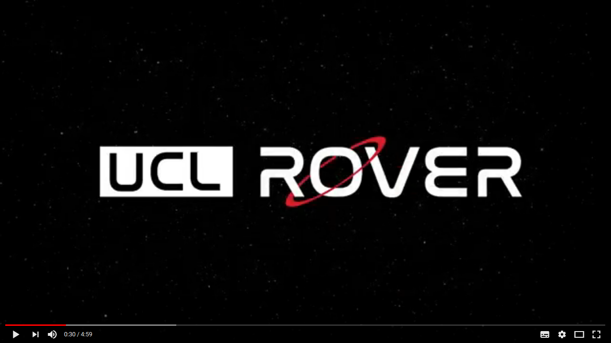
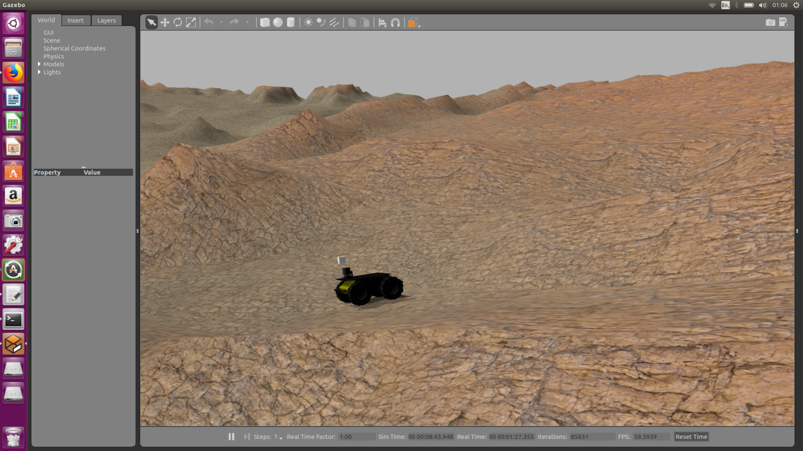
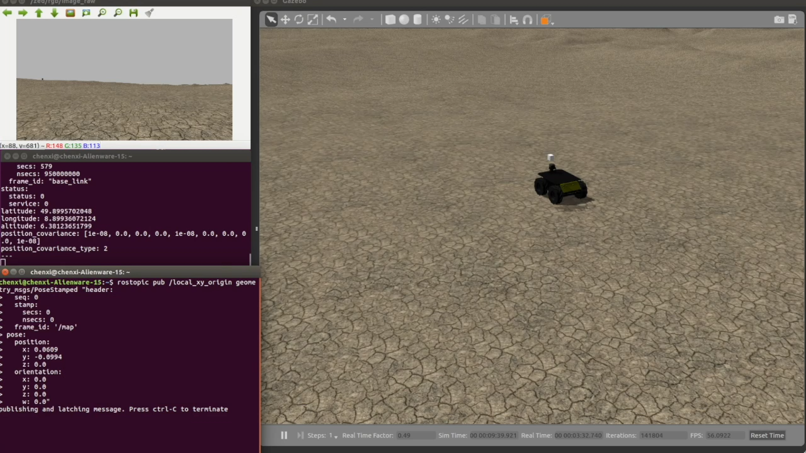
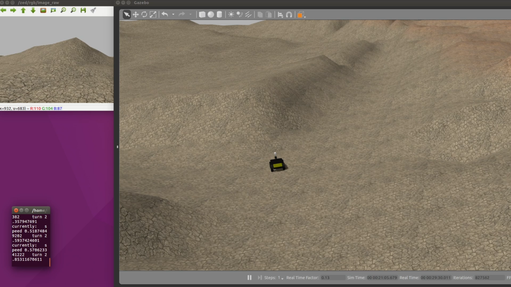
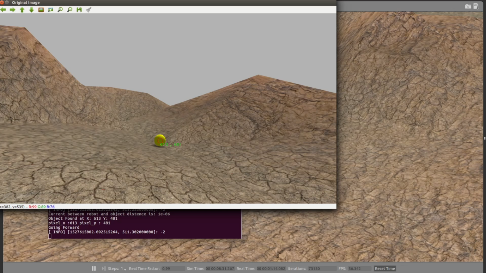
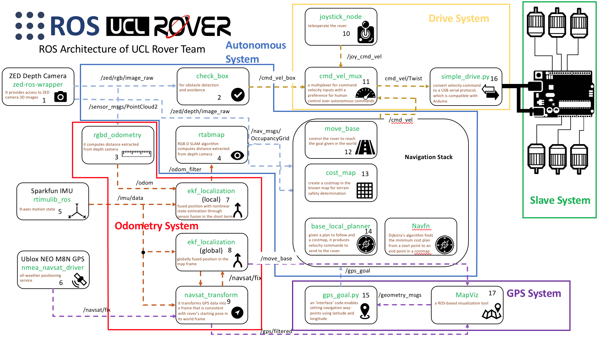
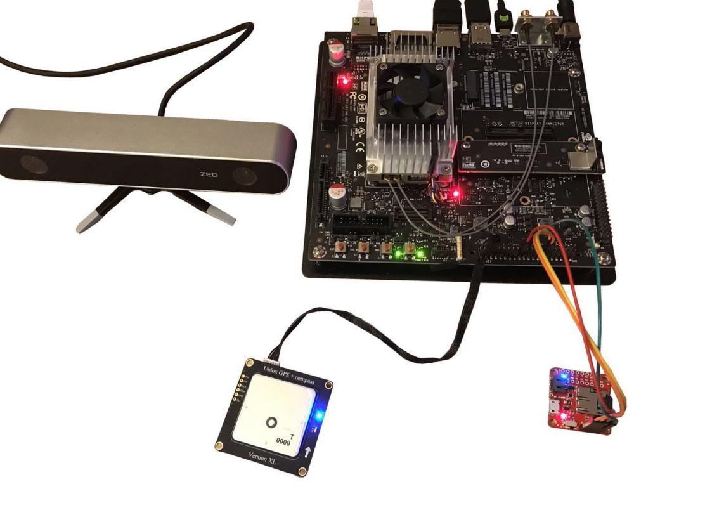
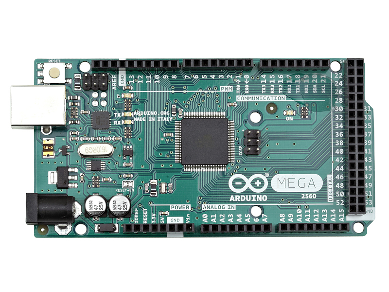

# UCLRep
Custom Repository of UCL.

Using Husky Robot for simulator.

## Discription

Completing this project has been the most exciting and ambitious undertakings. We scratched from zero and had experienced enormous pressure and stress. After all the sleepless nights and relentless toil, we want to take this moment to thank you - Daniel Snider (https://github.com/danielsnider) who helped us making this a reality. Your reference guided us making this dream come true. To create a better development environment, we decided to open source our autonomous driving system to contribute to a better world.

The autonomous system is developed with Robotic Operating System (ROS) and C/C++. It has three functions: GPS Navigation, Autonomous Navigation and Image Processing. The whole system has the ability of navigating to the provided GPS coordinate, avoiding obstacles and detecting a tennis ball elevated 10-50cm off the ground. The design goal of the system originally is to help UCL Rover Team as the first UK’s university rover team to represent the UK to compete in the University Rover Challenge, in Utah, the US and European Rover Challenge in Poland. The autonomous system of UCL Mars Rover is consisted of two sub-systems: the master system, developed with ROS and run on NVIDIA JETSON TX2 and the slave system, developed with C++ and run on Arduino MEGA.

To know more about the team: https://www.uclrover.com

Demonstration of UCL Rover and the autonomous function:

[](https://youtu.be/lozCbwh67XY "UCL Rover Promotional Video | European Rover Challenge 2018")

Full demonstration of the Autonomous System: [Full Document](https://github.com/CustRep/UCLRep/blob/master/doc/The%20Autonomous%20System%20Demonstration.pdf).











## Hardware List

| Hardware |  description |
|----------|--------------|
| NVIDIA Jetson TX2 | the Master System processor|
| Arduino Mega 2560 | the Slave System processor |
| Ublox NEO-M8N GPS unit | GPS sensor |
|ZED Depth Camera |distance measurement and object detection |
|SparkFun Razor 9DoF IMU |Measure inertia and localise the rover |

<div align=center>
Hardware of Master System</div>

<div align=center>
Slave System Hardware</div>

## Dependency

Before begin our project, we recommended that you install following libraries:
```
sudo apt-get install ros-kinetic-octomap-ros ros-kinetic-rtabmap
```

## Usage

Under command just choose one to run, like #Simualtor or #RealBot
### Simualtor

Open terminal and typing under command:
```
roslaunch husky_gazebo husky_playpen.launch
```

Using under command for checkout topic:
```
rostopic echo /navsat/fix #check GPS message
rostopic echo /zed/rgb/image_raw #check camera image
rostopic echo /scan #check laser message
```
### RealBot

Open terminal and typing under command to bringup your own driver:
```
roslaunch <your_driver_package> <your_driver.launch>
roslaunch zed_wrapper zed.launch
#roslaunch gpslaunch 
#roslaunch laserlaunch
```

## Common Steps

### Navigation
```
roslaunch husky_rtabmap_config navigation.launch #simulator simulation:=true
roslaunch husky_rtabmap_config mapping_rviz.launch #simulator simulation:=true
```

### Keyboard Teleop
```
roslaunch husky_teleop keyboard_teleop.launch
```

### Checkout topic list
```
rostopic list
```

### Checkout node list
```
rosnode list
```

### Take photos
```
mkdir -p /home/$USER/Pictures/gazebo_photos
cd /home/$USER/Pictures/gazebo_photos
rosrun image_view image_view image:=/zed/rgb/image_raw
```
### Visual
```
rosrun rover_vision test_tennis_ball_test
```

### GPS
```
roslaunch gps_goal gps_goal.launch
roslaunch gps_goal initialize_origin.launch origin:=auto
rostopic pub /local_xy_origin geometry_msgs/PoseStamped ’{header: {frame_id: "/map " } , pose: {position: {x:-10 , y:-1 }}}’ -1
rostopic pub /gps_goal_fix sensor_msgs/NavSatFix "{latitude: 49.91, longitude: 8.90}" -1
```
OR
```
rostopic pub /gps_goal_pose geometry_msgs/PoseStamped '{ header: { frame_id : "/ map " } , pose: { position: { x: 43.658 , y: -79.379 } } } ' -1
```
